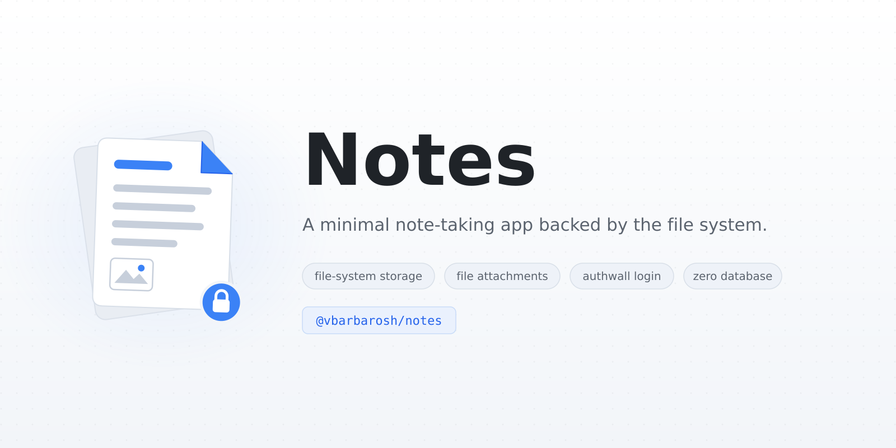

A minimal note-taking app backed by the file system.

Supports creating, editing, deleting, and listing notes.
Each note is stored as a directory with associated files.

## Demo

https://github.com/user-attachments/assets/15b29105-69e5-49c8-892c-4da7226dec2d

## Authentication

Natively supports [authwall](https://github.com/vbarbarosh/authwall) — a minimal login
gateway for protecting internal apps. Authwall sits in front of the app as a reverse
proxy, handles sign-in, and forwards each authenticated request with an `X-Auth-User`
header, which the app picks up as the current user.

The bundled `docker-compose.yaml` runs this setup out of the box:

    docker compose up
    # http://localhost:3000 — sign in via authwall (seed user foo, password foo)

## YouTube downloads

Add a YouTube link to a note, then open its **⋯** menu and choose **Download
YouTube video** (MP4) or **Extract YouTube MP3**. Files appear as attachments
under `files/youtube/`. Repeating a job skips existing files.

See [YouTube setup and VPS troubleshooting](docs/youtube.md) for installation,
proxy/cookie configuration, and diagnosing downloads that work on a PC but fail
on a server.
