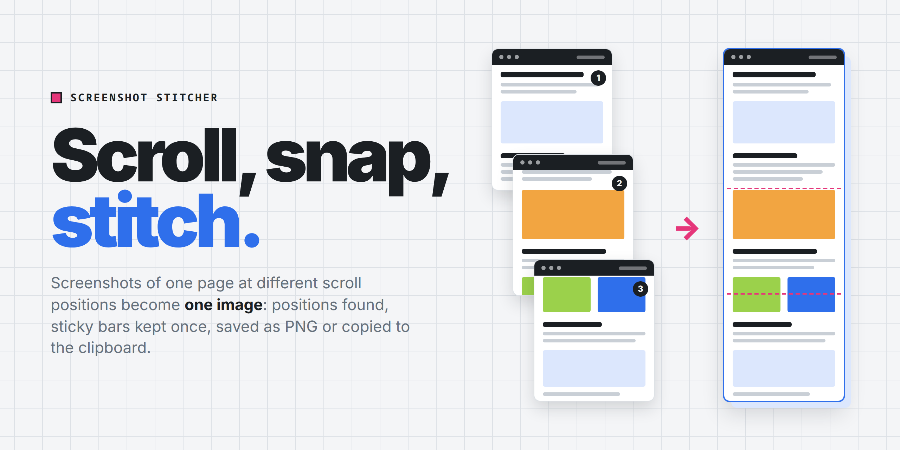

# Screenshot Stitcher

A single-page app that glues screenshots of one page, taken at different
scroll positions, into one big image.

## Usage

Open `index.html` in a browser (Vue 2 is loaded from jsdelivr). Drop
screenshots on the page, paste them with Ctrl+V, or click **Add screenshots**.
Then **Save PNG** (Ctrl+S) or **Copy** (Ctrl+C) the result. **Download ZIP**
saves the screenshots themselves, pasted ones included.

## What it does

- finds where each screenshot belongs; the order you add them in does not matter
- detects the scrolling direction, vertical or horizontal, or takes it from the **Scrolling** setting
- keeps sticky headers and footers once, even when a tooltip covers one of them
- crops fixed side panels: a sidebar, a toolbar, the scrollbar
- shows each screenshot's position and match; a position can be set by hand

## Limits

- neighbouring screenshots must overlap
- scrolling is vertical or horizontal, not both at once
- all screenshots must have the same width (height, when scrolling sideways)
- PNG input: lossy JPEG breaks the exact matching
- browsers cap a canvas at 32767 px per side

## Cover

`img/cover.png` and `img/cover-dark.png` are rendered from `img/cover.html`
at 1280×640, device scale 2; add the `dark` class to `<html>` for the dark one.
